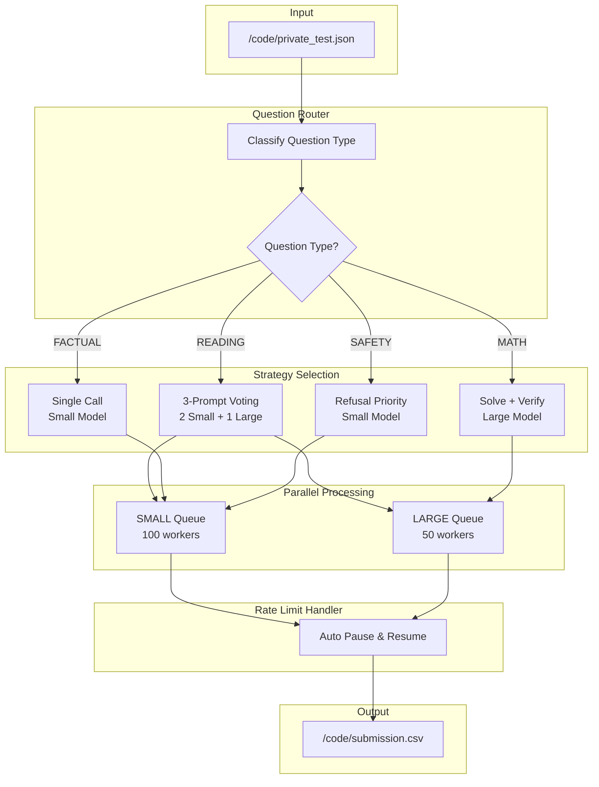

# VNPT AI Hackathon - Track 2: The Builder

<div align="center">


**Vietnamese Multi-Domain Question Answering System**  
*Powered by VNPT AI LLM with Advanced Reasoning & Multi-Strategy Voting*

</div>

---

## Table of Contents
- [Quick Start](#quick-start)
- [GitHub Repository](#github-repository)
- [Pipeline Flow](#pipeline-flow)
- [Data Processing](#data-processing)
- [Resource Initialization](#resource-initialization)
- [Docker Deployment](#docker-deployment)
- [Project Structure](#project-structure)
- [Team](#team)

---

## Quick Start

### Docker Hub Image
```bash
docker pull noskaiser231000/just2try_thebuilder:latest
```

### Run Inference (BTC Format)
```bash
docker run --gpus all \
  -v /path/to/api-keys.json:/code/api-keys.json \
  -v /path/to/private_test.json:/code/private_test.json \
  noskaiser231000/just2try_thebuilder:latest
```

### Output
```
/code/submission.csv
```

---

## GitHub Repository

**Public Repository:** https://github.com/noskaiser2310/AInicorns_TheBuilder_public.git

### Clone Repository
```bash
git clone https://github.com/noskaiser2310/AInicorns_TheBuilder_public.git
cd AInicorns_TheBuilder_public
```

### Install Dependencies
```bash
pip install -r requirements.txt
```

---

## Run Without Docker

### Cách 1: Chạy với Default Workers (50 Small + 30 Large)
```bash
python predict.py --input private_test.json --output submission.csv
```

### Cách 2: Chạy với High Performance (Recommended for Production)
```bash
python predict.py --input private_test.json --output submission.csv \
  --small-workers 500 --large-workers 200
```

### CLI Parameters

| Parameter | Default | Recommended | Description |
|-----------|---------|-------------|-------------|
| `--input` | `/code/private_test.json` | - | Input JSON file |
| `--output` | `/code/submission.csv` | - | Output CSV file |
| `--small-workers` | `50` | `500` | Parallel workers for SMALL model |
| `--large-workers` | `30` | `200` | Parallel workers for LARGE model |
| `--cache-version` | `v10` | - | Cache version for resume |

### Rate Limit Handling
- Nếu vượt quota API → Tự động dừng → Chờ reset (~1 giờ) → Tiếp tục
- Tất cả progress được lưu vào cache, không mất dữ liệu

---

## Run With Docker

### Build Docker Image từ Source
```bash
docker build -t just2try_thebuilder .
```

### Run với Default Workers
```bash
docker run --gpus all \
  -v $(pwd)/api-keys.json:/code/api-keys.json \
  -v $(pwd)/private_test.json:/code/private_test.json \
  just2try_thebuilder
```

### Run với High Performance Workers
```bash
docker run --gpus all \
  -v $(pwd)/api-keys.json:/code/api-keys.json \
  -v $(pwd)/private_test.json:/code/private_test.json \
  just2try_thebuilder \
  python predict.py --small-workers 500 --large-workers 200
```

### Verify kết quả
```bash
docker run --gpus all \
  -v $(pwd)/api-keys.json:/code/api-keys.json \
  -v $(pwd)/private_test.json:/code/private_test.json \
  -v $(pwd)/output:/output \
  just2try_thebuilder bash -c "python predict.py && cp /code/submission.csv /output/"

cat output/submission.csv
```

---

## Pipeline Flow



### Question Types & Strategies

| Type | Model | Strategy |
|------|-------|----------|
| READING | SMALL + LARGE | 3-prompt voting (2 Small + 1 Large) with tiebreaker |
| MATH | LARGE | Solve then Verify with step-by-step validation |
| FACTUAL | SMALL | Single call with domain-specific prompts |
| SAFETY | SMALL | Prioritize "cannot answer" option for harmful content |

---

## Data Processing

### Input Format
BTC sẽ mount file `/code/private_test.json` với format:
```json
[
  {
    "qid": "test_0001",
    "question": "Câu hỏi tiếng Việt...",
    "choices": ["A. Đáp án 1", "B. Đáp án 2", "C. Đáp án 3", "D. Đáp án 4"]
  }
]
```

### Output Format
Pipeline xuất `/code/submission.csv` với 2 cột:
```csv
qid,answer
test_0001,A
test_0002,B
test_0003,C
```

### Processing Steps
1. Load questions from JSON
2. Classify each question type (READING/MATH/FACTUAL/SAFETY)
3. Route to appropriate model (SMALL/LARGE)
4. Generate answers with strategy-specific prompts
5. Extract final answer using regex patterns
6. Save to CSV with qid,answer format

---

## Resource Initialization

### No External Resources Required
Solution sử dụng **VNPT AI LLM API only** - không cần:
- Vector Database
- Pre-trained model weights
- External indexing
- Local GPU inference

### API Keys Configuration
File `api-keys.json` (được BTC mount vào `/code/`):
```json
[
  {"llmApiName": "LLM small", "authorization": "Bearer ...", "tokenId": "...", "tokenKey": "..."},
  {"llmApiName": "LLM large", "authorization": "Bearer ...", "tokenId": "...", "tokenKey": "..."}
]
```

### Dependencies
```
requests>=2.28.0
tqdm>=4.65.0
numpy>=1.24.0
pandas>=2.0.0
```

---

## Docker Deployment

### Docker Hub Image
```
noskaiser231000/just2try_thebuilder:latest
```

### Build Locally
```bash
docker build -t just2try_thebuilder .
```

### Run Container (BTC Format)
```bash
docker run --gpus all \
  -v /path/to/api-keys.json:/code/api-keys.json \
  -v /path/to/private_test.json:/code/private_test.json \
  just2try_thebuilder
```

### Verify Output
```bash
# Check submission.csv exists
docker run --gpus all \
  -v /path/to/api-keys.json:/code/api-keys.json \
  -v /path/to/private_test.json:/code/private_test.json \
  -v $(pwd):/output \
  just2try_thebuilder bash -c "python predict.py && cp /code/submission.csv /output/"
```

### Dockerfile Specs
| Spec | Value |
|------|-------|
| Base Image | `nvidia/cuda:12.2.0-devel-ubuntu20.04` |
| Entry Point | `bash inference.sh` |
| Input | `/code/private_test.json` |
| Output | `/code/submission.csv` |

---

## Project Structure

```
Just2Try_TheBuilder/
├── predict.py              # Entry-point: Load → Classify → LLM → Extract → Save CSV
├── question_router.py      # Question type detection, model routing, prompt building
├── vnpt_api_client.py      # VNPT API client with retry logic and rate limit handling
├── inference.sh            # Docker entry point script
├── Dockerfile              # Container config (CUDA 12.2)
├── requirements.txt        # Python dependencies
├── README.md               # Documentation
└── .dockerignore           # Build exclusions
```

### Core Components

| File | Purpose |
|------|---------|
| `predict.py` | Main pipeline: load questions, parallel LLM calls, extract answers, save CSV |
| `question_router.py` | Classify question type, select model, build domain-specific prompts |
| `vnpt_api_client.py` | Handle API calls with retry, rate limit handling, response caching |
| `inference.sh` | Entry point that runs `python predict.py` |

### CLI Parameters

```bash
python predict.py [OPTIONS]
```

| Parameter | Default | Description |
|-----------|---------|-------------|
| `--input` | `/code/private_test.json` | Input JSON file |
| `--output` | `/code/submission.csv` | Output CSV file |
| `--small-workers` | `100` | Parallel workers for SMALL model |
| `--large-workers` | `50` | Parallel workers for LARGE model |

---

## Team

<div align="center">

### Team Just2Try

**Track 2: The Builder**  
*VNPT AI Hackathon - Age of AInicorns 2024*

---

Made with dedication by Team Just2Try

</div>
